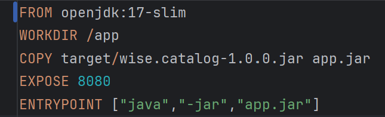

# wiseCataloggit


**Catálogo para busca de livros** — Um microserviço RESTful construído com Java 17 e Spring Boot para gerenciar e buscar informações de livros, integrado com MongoDB.

## Sumário

- [Visão geral](#visão-geral)
- [Funcionalidades](#funcionalidades)
- [Tecnologias utilizadas](#tecnologias-utilizadas)
- [Design pattern](#design-pattern)
- [Estrutura de dados](estrutura-dados)
- [Como executar](#como-executar)
  - [Localmente](#localmente)
- [API endpoints](#endpoints)
- [Melhorias e considerações finais](#melhorias-e-considerações-finais)

---

## Visão Geral

O wiseCatalog é um serviço que facilita a busca e a consulta de dados sobre livros no catálogo da API OpenBook.
A API permite pesquisas por critérios como ID, título, autor, gênero e livros mais recentes, retornando as respostas
no formato JSON.

## Funcionalidades

- Pesquisa por parâmetros como ID, título, autor, gênero e livros mais recentes.
- Possui configuracao de login para que apenas usuarios autenticados e autorizados consigam acessar os endpoints de busca.
- Integração com MongoDB para armazenamento persistente.
- Cache em Redis para otimizar consultas.
- Deploy facilitado com Docker e Docker Compose.

## Endpoints

Registro e login
Para possuir acesso aos endpoints, é necessário criar um registro. Path e body da request (JSON):

    POS /auth/register - Deve ser enviado um body em formato application/json

    {
    "login": "victor",
    "password": "123456",
    "role": "ADMIN" //ADMIN ou USER
    }

Depois, para pegar um token e acessar todos os endpoints por uma hora com eles, chamar o login. Path e body da request (JSON):

    POST /auth/login - Logar no sistema Deve ser enviado o um body em formato application/json
    {
    "login": "victor",
    "password": "123456"
    }

Depois, para criar uma lista, deve chamar o endpoint abaixo:

    POST /openLibrary/create - Logar no sistema Deve ser enviado uma lista no body 
    ["triller", "comedy", "romance", "action", "fantasy"]


Consultas (as requisições precisam do token retornado no endpoint de login):

    GET /books?page=0&pageSize=10 - Retorna todos os livros cadastrados
    GET /books/author/{author} - Retorna todos os livros do autor informado
    GET /books/genre/{genre} - Retorna todos os livros por gênero
    GET /books/{id} - Retorna um livro por ID
    GET /books/recently - Retorna os últimos livros acessados (do retorno por id)

Depois, caso necessite, chamar o endpoint abaixo para deletar a lista de livros e limpar o redis:

    DELETE /openLibrary/delete

## Tecnologias Utilizadas

- **Java 17**
- **Spring Boot** (Spring Web, Spring Data MongoDB)
- **MongoDB** (armazenamento)
- **Redis** (cache)
- **Maven** (gerenciamento de dependências)
- **Docker** e **Docker Compose** (deploy)

## Design-pattern

Para organizar melhor o projeto, utilizei uma arquitetura baseada no padrão de design MVC (Model-View-Controller), com pequenas adaptações para a estruturação das pastas e com ausência da camada View.
- O MVC (Model-View-Controller) é um padrão de arquitetura para organizar aplicações em três camadas principais:
  Model (Modelo): representa os dados e a lógica de negócio da aplicação.
  View (Visão): é a interface com o usuário, responsável por exibir os dados.
  Controller (Controlador): atua como intermediário, recebendo as entradas do usuário, processando-as via Model e atualizando a View.

Esse padrão ajuda a separar responsabilidades, tornando o código mais organizado, modular e fácil de manter.
- Existem três pastas principais: domain, app e infra.
- Na pasta domain, ficam os mappers, entidades, DTOs e exceções.
- Na pasta infra, ficam as chamadas externas e configurações.
- Na pasta app, estão os controllers, services, repositories e components.
- Embora não seja uma organização tradicional do padrão MVC, aproveito a simplicidade e praticidade desse modelo para estruturar as pastas, facilitando a localização das classes de acordo com o seu escopo de atuação nas pastas raiz.

## Estrutura de dados
- O BookDTO é uma classe simples utilizada para transportar dados entre diferentes camadas da aplicação, controller e o serviço. Ele contém apenas os campos necessários para a troca de informações para os GETs da API. Representa o dado de forma simplificada e desacoplada da persistência.
- O uso de DTOs permite expor apenas os campos relevantes nas respostas da API, mantendo a estrutura interna (BookEntity) protegida e adaptável a mudanças no banco sem quebrar contratos externos.


    private String id;
    private String title;
    private String author;
    private int publicationYear;
    private String genre;

- O BookEntity, por outro lado, representa a entidade persistida no banco de dados
- Ela está anotada com @Document(collection = "books"), o que indica que o MongoDB irá armazenar os documentos dessa classe na coleção books. O campo _id é marcado com @Id e mapeado para o campo _id no documento BSON do Mongo, usando ObjectId como tipo, o que é comum em bancos NoSQL para garantir unicidade e eficiência de indexação.

- No contexto de um banco NoSQL como o MongoDB:


    private ObjectId _id;
    private String title;
    private String author;
    private int publicationYear;
    private String genre;

- Não há a rigidez de esquemas típica de bancos relacionais, ou seja, documentos da mesma coleção podem ter campos diferentes sem causar erros.
- A serialização e desserialização entre BookEntity e o documento no MongoDB é feita automaticamente pelo Spring Data MongoDB, respeitando as anotações (@Document, @Field, @Id).

- Em resumo: o DTO simplifica e controla o tráfego de dados, enquanto a Entity representa a estrutura persistida no MongoDB, aproveitando a flexibilidade do NoSQL para armazenar dados sem necessidade de schema fixo e com capacidade de evolução rápida.

## Como Executar

### Pré-requisitos

Requisitos para rodar o projeto localmente em um container Docker:
- Docker
- Git
- Maven 3.9

Opcionais:
- MongoDB Compass – caso queira visualizar o banco de dados (integração com Docker).
- IntelliJ Community – caso queira acompanhar os logs da aplicação. Esses logs também podem ser visualizados pelo Docker Compose.

### Localmente

- Instale o **Git** pelo site: [https://git-scm.com/downloads](https://git-scm.com/downloads)
- Baixe a IDE (recomendo o **IntelliJ**) para visualização do projeto.
- Baixe as versões do **JDK** e do **Spring** conforme indicadas na seção **Tecnologias Utilizadas**.
- Abra o terminal da IDE e digite o comando:

    ```bash
    git clone https://github.com/victsismtto/wiseCatalog.git

- Após clonar o repositório, selecione a branch que deseja para testar a API — por exemplo, a versão mais estável: release/1.0.0.
- Para selecionar a branch desejada, no IntelliJ você pode usar o menu de seleção de branches (dropdown) ou o comando:

    ```bash
    git checkout release/1.0.0

#### Maven:
- Clique no menu File (canto superior esquerdo do IntelliJ) e selecione Settings.
- No macOS, o caminho pode variar, mas a opção Settings será a mesma.
- Acesse Build, Execution, Deployment → Maven.
- No campo "Maven home path" podemos selecionar a pasta que esta localizado o maven ou selecionar o maven instalado nos plugins do próprio IntelliJ selecionando a opção Bundled (Maven 3) caso o maven seja da versao 3.9.
- Nos campos "User Settings File" e "Maven repository", selecionar a pasta .../.m2/repository, caso não possua esta pasta, ela pode ser localizada em Users/seu usuario/.m2 (ela fica oculta, geralmente).
- Selecione nos dois campos a opção "Override".
- Repita o mesmo procedimento para o arquivo settings.xml (mesma hierarquia de pastas e configuração).
- Apertar Apply e depois OK.


#### JDK
- No IntelliJ, clique em File → Project Structure....
- Na lateral esquerda, selecione Project.
- No campo SDK, selecione a versão 17. Em seguida, clique em Apply.
- Em SDKs, confirme que a mesma versão está selecionada.
- Clique em Apply e depois OK.


#### Configuração - redis e mongodb
- Abra o arquivo docker-compose.yml, pasta se encontra na raiz do projeto.
- Existe duas configurações de dependencias que o projeto possui (redis e mongoDB).

Exemplo:

```yaml
  redis:
    image: redis:latest
    ports:
      - "6379:6379"
    volumes:
      - redis_data:/data

  wise-catalog-mongo:
    image: mongo:latest
    ports:
      - "27017:27017"
    volumes:
      - mongo_data:/data/db
```
- Os values "ports" e "images" indicam qual porta você vai conectar com cada componente e a imagem que o projeto vai baixar, no caso do exemplo, a imagem baixada vai ser a ultima versão encontrada.

#### Build usando Docker

- O primeiro passo é executar o comando "mvn clean install package" no seu terminal (precisa ser dentro da pasta do projeto).
- Isso faz com que o .jar mesma versão que foi adicionado no pom.xml.


- Depois de realizar o build o projeto, no console do terminal: gerou o .jar com a versão do projeto


- E no arquivo "Dockerfile" devemos adicionar o path que o .jar está localizado com a mesma versão que o projeto foi construído.



- Após seguir as configurações, estamos prontos para criar a imagem do projeto e subir ele no container.
- Para isso, vamos executar o comando: "docker compose up --build" no terminal, dentro da pasta do projeto.
- Pode rodar o docker direto na IDE com botão de run caso baixe a o plugin do docker no IntelliJ.
- Lembrando que parar subir em sistemas Windows, deve ter o Docker ou rancher Desktop, por exemplo, instalado para rodar comandos docker.

- O Docker compose vai identificar quais dependências que o seu projeto tem, no caso, o mongoDB e o Redis, após identificar as dependências e vai baixar as imagens nas versões explicitadas no docker-compose.yml.
- Após o build do docker compose terminar, as imagens do redis, mongoDB e wise-catalog estarão criadas no container, sendo visíveis no Docker Desktop.

Container:


Imagens:


- A collection e o environment do Postman estão na pasta postman, na raiz do projeto, para que seja possível executar os endpoints da API.

## Melhorias e Considerações finais

- Poderia ser adicionada uma consulta para verificar a disponibilidade de compra do livro, mostrando a quantidade disponível no estoque.
- Implementar um limite no tamanho do cache para a consulta dos livros mais recentemente visualizados.
- Caso o projeto seja hospedado na internet, por exemplo, na Azure, as secrets deveriam ser armazenadas em um Key Vault e espelhadas no pod para garantir a proteção delas.
- Adicionar certificado de transporte seguro e assinatura digital caso sejam criados endpoints para compras on-line.
- Utilizar um batch para incluir novos livros ou atualizar as quantidades disponíveis conforme o estoque.
- Faltou implementar uma configuração que apenas usuários com role ADMIN possa acessar esse endpoint.

## Author

- **Victor Sismotto** - *Provided README Template* -
  [Victor Sismotto](https://github.com/victsismtto/)

