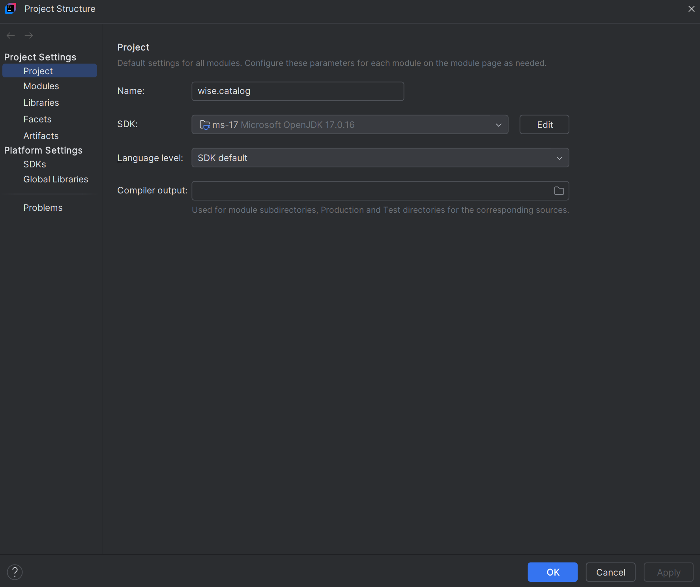

# wiseCatalog


**Catálogo para busca de livros** — Um microserviço RESTful construído com Java 17 e Spring Boot para gerenciar e buscar informações de livros, integrado com MongoDB.

## Sumário

- [Visão Geral](#visão-geral)
- [Funcionalidades](#funcionalidades)
- [Tecnologias Utilizadas](#tecnologias-utilizadas)
- [Como Executar](#como-executar)
    - [Localmente/Docker](#localmente)
- [API Endpoints](#api-endpoints)
- [Contribuições](#contribuições)

---

## Visão Geral

O wiseCatalog é um serviço que facilita a busca e a consulta de dados sobre livros no catálogo da API OpenBook.
A API permite pesquisas por critérios como ID, título, autor, gênero e livros mais recentes, retornando as respostas
no formato JSON.

## Funcionalidades

- Pesquisa por parâmetros como ID, título, autor, gênero e livros mais recentes.
- Integração com MongoDB para armazenamento persistente.
- Cache em Redis para otimizar consultas.
- Deploy facilitado com Docker e Docker Compose.

## Tecnologias Utilizadas

- **Java 17**
- **Spring Boot** (Spring Web, Spring Data MongoDB)
- **MongoDB** (armazenamento)
- **Redis** (cache)
- **Maven** (gerenciamento de dependências)
- **Docker** e **Docker Compose** (deploy)

## Como Executar

### Pré-requisitos

Requisitos para rodar o projeto localmente em um container Docker:
- Docker
- Git
- Maven 3.9

Opcionais:
- MongoDB Compass – caso queira visualizar o banco de dados (integração com Docker).
- IntelliJ Community – caso queira acompanhar os logs da aplicação. Esses logs também podem ser visualizados pelo Docker Compose.

### Localmente

- Instale o **Git** pelo site: [https://git-scm.com/downloads](https://git-scm.com/downloads)
- Baixe a IDE (recomendo o **IntelliJ**) para visualização do projeto.
- Baixe as versões do **JDK** e do **Spring** conforme indicadas na seção **Tecnologias Utilizadas**.
- Abra o terminal da IDE e digite o comando:
    ```bash
    git clone https://github.com/victsismtto/wiseCatalog/tree/develop

- Após clonar o repositório, selecione a branch que deseja para testar a API — por exemplo, a versão mais estável: release/1.0.0.
- Para selecionar a branch desejada, no IntelliJ você pode usar o menu de seleção de branches (dropdown) ou o comando:

    ```bash
    git checkout release/1.0.0

#### Maven:
- Clique no menu File (canto superior esquerdo do IntelliJ) e selecione Settings.
- No macOS, o caminho pode variar, mas a opção Settings será a mesma.
- Acesse Build, Execution, Deployment → Maven.
- No campo "Maven home path" podemos selecionar a pasta que esta localizado o maven ou selecionar o maven instalado nos plugins do próprio IntelliJ selecionando a opção Bundled (Maven 3) caso o maven seja da versao 3.9
- Nos campos "User Settings File" e "Maven repository", selecionar a pasta .../.m2/repository, caso não possua esta pasta, ela pode ser localizada em Users/seu usuario/.m2 (ela fica oculta, geralmente).
- Selecione nos dois campos a opção "Override"
-  Repita o mesmo procedimento para o arquivo settings.xml (mesma hierarquia de pastas e configuração).
- Apertar Apply e depois OK


#### JDK
- No IntelliJ, clique em File → Project Structure....
- Na lateral esquerda, selecione Project.
- No campo SDK, selecione a versão 17. Em seguida, clique em Apply.
- Em SDKs, confirme que a mesma versão está selecionada.
- Clique em Apply e depois OK.



#### Configuração do redis e mongodb
- Abra o arquivo docker-compose.yml, pasta se encontra na raiz do projeto.
- Existe duas configurações de dependencias que o projeto possui (redis e mongoDB).

Exemplo:

```yaml
  redis:
    image: redis:latest
    ports:
      - "6379:6379"
    volumes:
      - redis_data:/data

  wise-catalog-mongo:
    image: mongo:latest
    ports:
      - "27017:27017"
    volumes:
      - mongo_data:/data/db
```
- Os values "ports" e "images" indicam qual porta você vai conectar com cada componente e a imagem que o projeto vai baixar, no caso do exemplo, a imagem baixada vai ser a ultima versão encontrada.

#### Build usando Docker

- O primeiro passo é executar o comando "mvn clean install package" no seu terminal (precisa ser dentro da pasta do projeto).
- Isso faz com que o .jar mesma versão que foi adicionado no pom.xml.


- Depois de buildar o projeto, repare no console do terminal: gerou o .jar com a versão do projeto


- E no arquivo "Dockerfile" devemos adicionar o path que o .jar está localizado com a mesma versão que o projeto foi construído


- Após seguir as configurações, estamos prontos para criar a imagem do projeto e subir ele no container.
- Para isso, vamos executar o comando: "docker compose up --build" no terminal, dentro da pasta do projeto.
- Pode rodar o docker direto na IDE com botão de run caso baixe a o plugin do docker no IntelliJ.
- Lembrando que parar subir em sistemas Windows, deve ter o Docker Desktop instalado para rodar comandos docker.

- O Docker compose vai identificar quais dependências que o seu projeto tem, no caso, o mongoDB e o Redis, após identificar as dependências e vai baixar as imagens nas versões explicitadas no docker-compose.yml
- Após o build do docker compose terminar, as imagens do redis, mongoDB e ce-wise-catalog estarão criadas no container, sendo visíveis no Docker Desktop

Container:


Imagens:


## Author

- **Victor Sismotto** - *Provided README Template* -
  [Victor Sismotto](https://github.com/victsismtto/)

